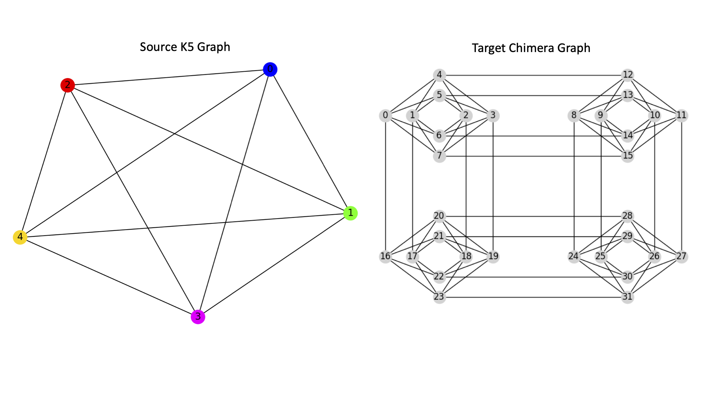
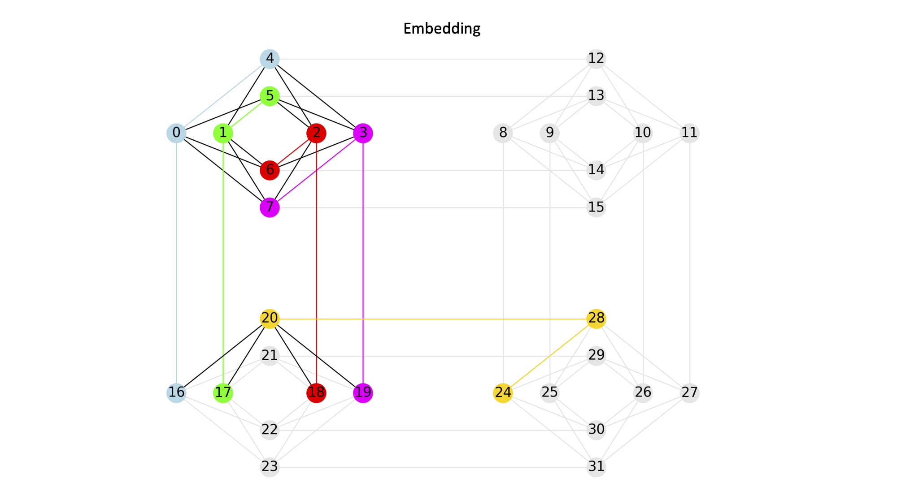

.. _minorminer_clique_embedding:

================
Clique Embedding
================

.. automodule:: minorminer.busclique

If your source graph is a clique and your target graph is either a Chimera or
Pegasus graph, :meth:`~minorminer.busclique.find_clique_embedding` may produce
better embeddings than the generic :meth:`~minorminer.find_embedding` method.

.. autofunction:: find_clique_embedding

....

Caching
=======

If multiple clique or biclique embeddings need to be computed for a single
Chimera or Pegasus graph, it may be more efficient to retrieve these embeddings
through the :class:`busgraph_cache`, which creates LRU file-caches for the
target graph's cliques and bicliques.

Class
-----
.. autoclass:: busgraph_cache

Methods
-------

.. autosummary::
   :toctree: generated/

    busgraph_cache.cache_rootdir
    busgraph_cache.clear_all_caches
    busgraph_cache.find_biclique_embedding
    busgraph_cache.find_clique_embedding
    busgraph_cache.largest_balanced_biclique
    busgraph_cache.largest_clique
    busgraph_cache.largest_clique_by_chainlength

....

Examples
========

This example minor embeds a source clique of size 5 into a target Chimera graph.

.. code-block:: python

    from minorminer import busclique
    import dwave_networkx as dnx

    C = dnx.chimera_graph(2, 2)
    embedding = busclique.find_clique_embedding(5, C)

    print(embedding)
    {0: (0, 16, 4), 1: (1, 17, 5), 2: (2, 18, 6), 3: (3, 19, 7), 4: (24, 20, 28)}

