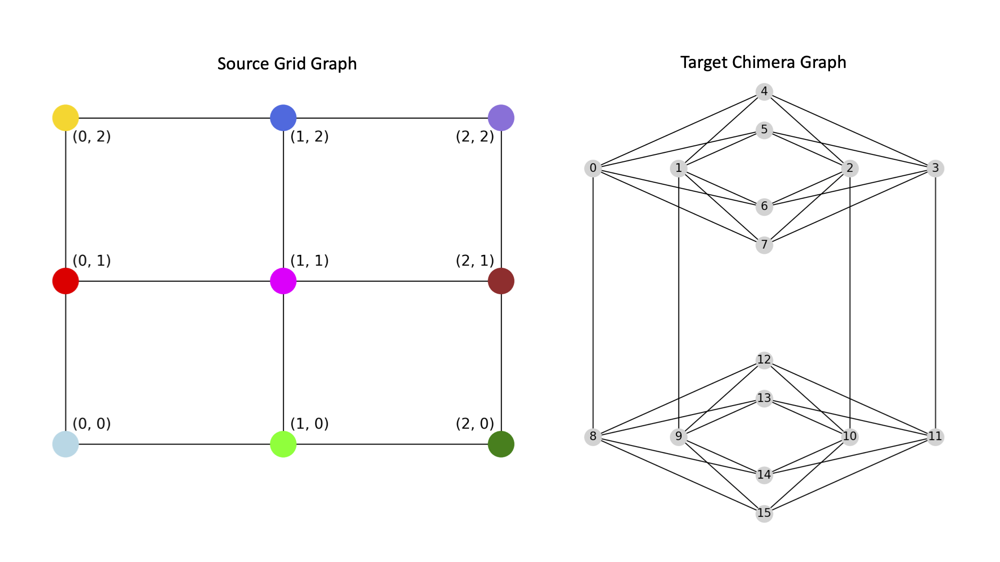

.. _layout_embedding:

================
Layout Embedding
================

:meth:`minorminer.layout.find_embedding()` offers a more specialized approach to
find an embedding through the use of the :class:`~minorminer.layout.layout.Layout` and
:class:`~minorminer.layout.placement.Placement` classes. This kind of embedding may be useful when
your source graph has a structure that is somewhat spatial, perhaps built on
2-dimensional or 3-dimensional data. It can also be useful for embedding graphs
with nodes of a low degree (i.e., a cubic graph).

.. autofunction:: minorminer.layout.find_embedding

....

Examples
========

This example minor embeds a 3x3 grid graph onto a Chimera graph.

.. code-block:: python

    import networkx as nx
    import minorminer.layout as mml

    grid_graph = nx.generators.lattice.grid_2d_graph(3, 3)
    C = dnx.chimera_graph(2,1)

    embedding = mml.find_embedding(grid_graph, C)
    print(embedding)
    # There are many possible outputs, and sometimes it might fail
    # and return an empty list
    # One run returned the following embedding:
    {(0, 0): [13], (1, 0): [0, 8], (0, 1): [9], (1, 1): [12], (0, 2): [14], (1, 2): [10], (2, 0): [7], (2, 1): [11, 3], (2, 2): [15]}

.. figure:: ../_images/layout_embedding.png
    :name: Layout_Embedding_2DGrid_Chimera
    :width: 800
    :alt: Embedding a source 2-dimensional 3x3 grid graph onto a target Chimera graph

....

Layout
======

.. currentmodule:: minorminer.layout.layout

.. autoclass:: Layout

Functions for Creating Layouts
------------------------------

.. autofunction:: p_norm
.. autofunction:: dnx_layout

....

Placement
=========

.. currentmodule:: minorminer.layout.placement

.. autoclass:: Placement

Functions for Creating Placements
---------------------------------

.. autofunction:: intersection
.. autofunction:: closest
